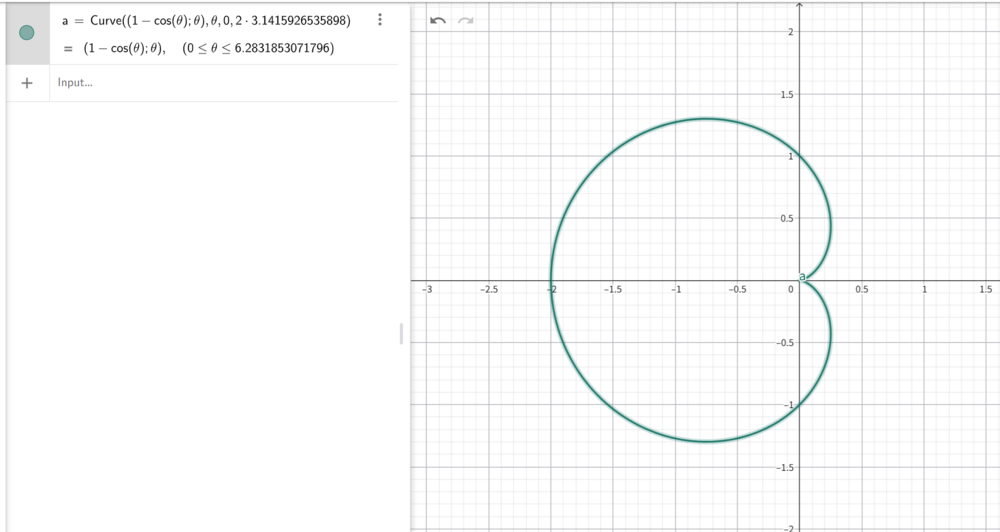

# 考研数学

按数学一考纲整理高等数学、线性代数、概率论与数理统计的题目、解答与关键思路。

## 一、高等数学

### 1. 常用函数图像

1. $r=1-\cos\theta$ 的图像

2. 

### 2. 函数、极限、连续

#### 题 001：含参数连乘比值的极限

##### 题目

设 $a>0$，求

$$
\lim_{n\to\infty}\frac{n!}{(a+1)(a+2)\cdots(a+n)}.
$$

##### 解答

记

$$
u_n=\frac{n!}{(a+1)(a+2)\cdots(a+n)}
=\prod_{k=1}^n\frac{k}{a+k}.
$$

每个因子都在 $(0,1)$ 内，但“每个因子趋于 1”本身不能决定乘积的极限。对乘积取对数：

$$
\ln u_n
=\sum_{k=1}^n\ln\left(1-\frac{a}{a+k}\right).
$$

利用 $0<x<1$ 时 $\ln(1-x)\le -x$，得到

$$
\ln u_n\le -a\sum_{k=1}^n\frac1{a+k}.
$$

右侧是调和级数尾部的常数倍，趋于 $-\infty$，所以 $\ln u_n\to-\infty$，从而

$$
\boxed{\lim_{n\to\infty}u_n=0}.
$$

##### 关键 inspiration

看到大量正因子的连乘，尤其是每个因子都趋于 $1$ 时，要想到“乘积取对数，把连乘变成求和”。再把对数项与调和级数比较，判断无限乘积是否衰减到 $0$。

#### 题 002：指数递推数列的收敛性

##### 题目

数列 $\{x_n\}$ 满足

$$
x_1>0,\qquad x_ne^{x_{n+1}}=e^{x_n}-1\quad(n=1,2,\ldots).
$$

证明 $\{x_n\}$ 收敛，并求 $\lim\limits_{n\to\infty}x_n$。

##### 解答

对函数 $e^x$ 在区间 $[0,x_n]$ 上使用拉格朗日中值定理，存在 $\xi_n\in(0,x_n)$，使

$$
\frac{e^{x_n}-1}{x_n}=e^{\xi_n}.
$$

而递推式给出

$$
e^{x_{n+1}}=\frac{e^{x_n}-1}{x_n}=e^{\xi_n}.
$$

由于指数函数严格单调，$x_{n+1}=\xi_n$，故

$$
0<x_{n+1}<x_n.
$$

因此 $\{x_n\}$ 单调递减且下有界，必收敛。设 $x_n\to A\ge0$，对递推式取极限得

$$
Ae^A=e^A-1,
$$

即

$$
(1-A)e^A=1.
$$

令 $g(x)=(1-x)e^x$。在 $x\ge0$ 上，

$$
g'(x)=-xe^x\le0,
$$

且当 $x>0$ 时严格小于 $0$。又 $g(0)=1$，所以方程 $g(A)=1$ 在 $A\ge0$ 上只有解 $A=0$。因此

$$
\boxed{\lim_{n\to\infty}x_n=0}.
$$

原手写解答的核心思路是正确的：用中值定理得到 $0<x_{n+1}<x_n$。书写时还应明确中值点 $\xi_n$ 的区间，并证明极限方程在 $A\ge0$ 上只有一个解。

##### 关键 inspiration

看到 $\dfrac{e^{x_n}-e^0}{x_n-0}$，应立即识别出它是指数函数的差商。中值定理能把差商写成 $e^{\xi_n}$，再借指数函数的单调性直接把 $x_{n+1}$ 夹在 $0$ 与 $x_n$ 之间。

#### 题 003：变上限积分递推数列

##### 题目

给定任意 $x_1\in\mathbb R$，数列满足

$$
x_{n+1}=\frac13x_n+\frac23-\frac12\int_1^{x_n}e^{-t^2}\,dt
\quad(n=1,2,\ldots).
$$

证明 $\lim\limits_{n\to\infty}x_n$ 存在并求其值。

##### 解答

设

$$
f(x)=\frac13x+\frac23-\frac12\int_1^xe^{-t^2}\,dt,
$$

则 $x_{n+1}=f(x_n)$。由变上限积分求导，

$$
f'(x)=\frac13-\frac12e^{-x^2}.
$$

因为 $0<e^{-x^2}\le1$，所以

$$
-\frac16\le f'(x)<\frac13,
\qquad |f'(x)|\le\frac13.
$$

由拉格朗日中值定理，

$$
|x_{n+1}-x_n|
=|f(x_n)-f(x_{n-1})|
\le\frac13|x_n-x_{n-1}|.
$$

反复使用可得

$$
|x_{n+1}-x_n|
\le\left(\frac13\right)^{n-1}|x_2-x_1|.
$$

当 $m>n$ 时，

$$
\begin{aligned}
|x_m-x_n|
&\le\sum_{k=n}^{m-1}|x_{k+1}-x_k|\\
&\le |x_2-x_1|\sum_{k=n}^{\infty}\left(\frac13\right)^{k-1}\\
&=\frac32|x_2-x_1|\left(\frac13\right)^{n-1}\to0.
\end{aligned}
$$

所以 $\{x_n\}$ 是柯西数列，因而收敛。设 $x_n\to A$。由 $f$ 连续，$A=f(A)$，即

$$
\frac23(A-1)=-\frac12\int_1^Ae^{-t^2}\,dt.
$$

若 $A>1$，等式左边为正、右边为负；若 $A<1$，左边为负、右边为正，均矛盾。因此只有 $A=1$，故

$$
\boxed{\lim_{n\to\infty}x_n=1}.
$$

##### 关键 inspiration

递推式能写成 $x_{n+1}=f(x_n)$ 时，除了“单调有界”，还要检查是否存在统一的 $|f'(x)|\le q<1$。一旦出现压缩系数，就对相邻两项作差，再用几何级数证明数列是柯西数列。

### 3. 一元函数微分学

#### 题 001：处处可导但导函数不连续

##### 题目

为什么函数可导不能推出导函数连续？请给出一个反例并证明。

##### 解答

令

$$
f(x)=
\begin{cases}
x^2\sin\dfrac1x,&x\ne0,\\
0,&x=0.
\end{cases}
$$

当 $x\ne0$ 时，

$$
f'(x)=2x\sin\frac1x-\cos\frac1x.
$$

在 $x=0$ 处按定义计算：

$$
f'(0)=\lim_{h\to0}\frac{f(h)-f(0)}h
=\lim_{h\to0}h\sin\frac1h=0.
$$

所以 $f$ 在每一点都可导。但是当 $x\to0$ 时，$-\cos(1/x)$ 不断振荡。例如取

$$
x_k=\frac1{2k\pi},\qquad
y_k=\frac1{(2k+1)\pi},
$$

则 $x_k,y_k\to0$，但

$$
f'(x_k)\to-1,\qquad f'(y_k)\to1.
$$

因此 $\lim_{x\to0}f'(x)$ 不存在，$f'$ 在 $0$ 处不连续。这说明

$$
f\text{ 可导}\not\Rightarrow f'\text{ 连续}.
$$

##### 关键 inspiration

要构造“原函数可导、导函数却不连续”的反例，可以把快速振荡的 $\sin(1/x)$ 乘上足够强的衰减因子。$x^2$ 保证原函数在 $0$ 处的差商趋于 $0$，但求导后仍留下不衰减的 $\cos(1/x)$，于是导函数发生振荡不连续。

#### 题 002：复合差商与零点可导的充要条件

记录日期：2026-09-04。来源：第一张图片，原书“P59例 2”。

##### 题目

设 $f(0)=0$，则 $f(x)$ 在点 $x=0$ 可导的充要条件为（）。

- （A）$\displaystyle\lim_{h\to0}\frac{f(1-\cos h)}{h^2}$ 存在。
- （B）$\displaystyle\lim_{h\to0}\frac{f(1-e^h)}h$ 存在。
- （C）$\displaystyle\lim_{h\to0}\frac{f(h-\sin h)}{h^2}$ 存在。
- （D）$\displaystyle\lim_{h\to0}\frac{f(2h)-f(h)}h$ 存在。

本题“极限存在”均指有限的双侧极限存在。

##### 解答

**答案：B。** 由于 $f(0)=0$，可导的定义就是

$$
f'(0)=\lim_{x\to0}\frac{f(x)}x
$$

存在。判断各选项时，要检查能否恢复这一完整的双侧差商。

###### B：既充分又必要

若 $f'(0)=d$，则

$$
\frac{f(1-e^h)}h
=\frac{f(1-e^h)}{1-e^h}\cdot\frac{1-e^h}{h}
\longrightarrow d\cdot(-1)=-d.
$$

反之，设 B 中的极限为 $\ell$。令 $x=1-e^h$，则 $h=\ln(1-x)$。该换元在零点附近一一对应，而且 $x$ 能从正、负两侧趋于 $0$。于是

$$
\frac{f(x)}x
=\frac{f(1-e^h)}h\cdot\frac{h}{1-e^h}
\longrightarrow\ell\cdot(-1)=-\ell.
$$

所以 $f'(0)$ 存在，且 $f'(0)=-\ell$。这就证明了充要性。

###### A：只探测右侧，不充分

因为 $1-\cos h\ge0$，即使 $h$ 从两侧趋于 $0$，函数的自变量仍只从右侧趋于 $0$。

取反例 $f(x)=|x|$，它满足 $f(0)=0$，但在 $0$ 不可导；然而

$$
\frac{f(1-\cos h)}{h^2}
=\frac{1-\cos h}{h^2}\longrightarrow\frac12.
$$

因此 A 不充分。它是必要条件：若 $f'(0)=d$，则 A 中的极限为 $d/2$。

###### C：数量级不匹配，会掩盖不可导性

仍取 $f(x)=|x|$。由

$$
h-\sin h=\frac{h^3}{6}+o(h^3),
$$

可得

$$
\frac{f(h-\sin h)}{h^2}
=\frac{|h-\sin h|}{h^2}
=\frac{|h|}{6}+o(|h|)\longrightarrow0.
$$

虽然 C 中极限存在，但 $f$ 在 $0$ 不可导，所以 C 不充分。

它也是必要条件：若 $f'(0)=d$，则

$$
\frac{f(h-\sin h)}{h^2}
=\frac{f(h-\sin h)}{h-\sin h}
\cdot\frac{h-\sin h}{h^2}
\longrightarrow d\cdot0=0.
$$

关键在于第二个因子趋于 $0$，不能由乘积收敛反推第一个因子收敛。

###### D：没有涉及 $f(0)$，不充分

题目仅给出 $f(0)=0$，并未假设在 $0$ 连续。取

$$
f(x)=
\begin{cases}
1,&x\ne0,\\
0,&x=0.
\end{cases}
$$

对任意 $h\ne0$，

$$
\frac{f(2h)-f(h)}h=\frac{1-1}{h}=0.
$$

所以 D 中极限存在，但 $f$ 在 $0$ 不连续，更不可能可导。

D 是必要条件：若 $f'(0)=d$，则

$$
\frac{f(2h)-f(h)}h
=2\frac{f(2h)}{2h}-\frac{f(h)}h
\longrightarrow2d-d=d.
$$

##### 关键 inspiration

1. **先写导数定义，再看换元是否保留两侧信息。** $1-\cos h$ 只能取非负值；$1-e^h$ 则在零点附近可以取正、负值。只有“内层趋于 0”还不够。
2. **看差商外的因子是否趋于非零常数。** B 中 $(1-e^h)/h\to-1$，可以反向恢复差商；C 中 $(h-\sin h)/h^2\to0$，可能把差商的问题掩盖掉。
3. **证明必要性不能代替证明充要性。** 四个选项都是必要条件，但只有 B 充分。排除其余选项，只需找到“条件成立而结论不成立”的反例。
4. **看到两个邻近点作差，检查是否漏掉了基点函数值。** $f(2h)-f(h)$ 不使用 $f(0)$；若没有连续性假设，应想到“去心邻域取常数、基点另赋值”的反例。

#### 题 003：连续条件下的差商与对称差商

记录日期：2026-09-04。来源：第二张图片，原书“P59例 1”。

##### 题目

设函数 $f(x)$ 在 $x=0$ 处连续，下列命题错误的是（）。

- （A）若 $\displaystyle\lim_{x\to0}\frac{f(x)}x$ 存在，则 $f(0)=0$。
- （B）若 $\displaystyle\lim_{x\to0}\frac{f(x)+f(-x)}x$ 存在，则 $f(0)=0$。
- （C）若 $\displaystyle\lim_{x\to0}\frac{f(x)}x$ 存在，则 $f'(0)$ 存在。
- （D）若 $\displaystyle\lim_{x\to0}\frac{f(x)-f(-x)}x$ 存在，则 $f'(0)$ 存在。

本题“极限存在”均指有限的双侧极限存在。

##### 解答

**答案：D。** 图片中对 A、B、C 的勾选判断是正确的。

###### A 正确：有限商极限迫使分子趋于零

设 $\displaystyle\lim_{x\to0}f(x)/x=a$，则

$$
\lim_{x\to0}f(x)
=\lim_{x\to0}\left(x\cdot\frac{f(x)}x\right)
=0.
$$

结合 $f$ 在 $0$ 连续，得 $f(0)=0$。

###### B 正确：利用连续性识别分子极限

设 $\displaystyle\lim_{x\to0}[f(x)+f(-x)]/x=b$，则

$$
\lim_{x\to0}[f(x)+f(-x)]
=\lim_{x\to0}\left(x\cdot\frac{f(x)+f(-x)}x\right)
=0.
$$

另一方面，由连续性，

$$
\lim_{x\to0}[f(x)+f(-x)]=2f(0).
$$

所以 $2f(0)=0$，即 $f(0)=0$。

补充：该商关于 $x$ 为奇函数，因此若双侧极限存在，必为 $0$；但判断本选项只需上面的证明。

###### C 正确：先确定 $f(0)$，再套导数定义

由 A 的论证先得到 $f(0)=0$，于是

$$
f'(0)=\lim_{x\to0}\frac{f(x)-f(0)}x
=\lim_{x\to0}\frac{f(x)}x.
$$

右侧由条件知存在，所以 $f'(0)$ 存在。

注意：不能在尚未确定 $f(0)=0$ 时，就直接把 $f(x)/x$ 当作导数定义中的差商。

###### D 错误：对称作差会抵消偶函数部分

取 $f(x)=|x|$。它在 $0$ 连续，且

$$
\frac{f(x)-f(-x)}x
=\frac{|x|-|-x|}{x}=0\qquad(x\ne0).
$$

所以 D 中的极限存在。但

$$
f'_+(0)=1,\qquad f'_-(0)=-1,
$$

左右导数不相等，故 $f'(0)$ 不存在。

通常的对称差商是 $[f(x)-f(-x)]/(2x)$；本题分母为 $x$，仅相差常数因子 $2$。对称差商极限存在，仍不能推出通常意义下可导。

##### 关键 inspiration

1. **商极限有限而分母趋于零，先推出分子趋于零。** 再结合连续性，把分子的极限转化成关于 $f(0)$ 的等式。
2. **导数定义必须减去基点函数值。** 从 $f(x)/x$ 出发，先证明 $f(0)=0$，再判定可导，不能省略逻辑前提。
3. **看到 $f(x)-f(-x)$，立即想到偶函数会被抵消。** 用连续但不可导的偶函数 $|x|$，就能说明对称差商可能完全看不见尖点。
4. **区分这两题的前提。** 本题明确给出连续性，所以反例也必须连续；上一题只给出 $f(0)=0$，排除其 D 项时可以使用不连续反例。

#### 题 004：根式与绝对值乘积的不可导点

记录日期：2026-09-04。来源：用户提供的题目图片，原题第 2 题。

##### 题目

函数

$$
f(x)=\sqrt[3]{(x+3)(x+1)}\,|x^3-x|
$$

的不可导点个数为多少？

##### 解答

先找出所有**可能**不可导的点。

- $\sqrt[3]{(x+3)(x+1)}$ 可能在被开方数为零处不可导，即 $x=-3,-1$；
- $|x^3-x|$ 可能在 $x^3-x=0$ 处不可导，即 $x=-1,0,1$。

因此只需检查

$$
x=-3,-1,0,1.
$$

在其余点，两个因子都可导，故乘积可导。

###### 1. \(x=-3\) 不可导

令 $t=x+3$。当 $t\to0$ 时，

$$
\sqrt[3]{(x+3)(x+1)}
=\sqrt[3]{t(t-2)}
\sim\sqrt[3]{-2t},
$$

而

$$
|x^3-x|\longrightarrow|-27+3|=24\ne0.
$$

又 $f(-3)=0$，故差商的大小满足

$$
\left|\frac{f(-3+t)-f(-3)}t\right|
\asymp\frac{|t|^{1/3}}{|t|}
=|t|^{-2/3}\longrightarrow+\infty.
$$

所以 $f$ 在 $x=-3$ 不可导。

###### 2. \(x=-1\) 可导——两个因子的奇性发生抵消

这一点是本题的陷阱。令 $t=x+1$，则

$$
(x+3)(x+1)=t(t+2),
$$

并且

$$
x^3-x=x(x-1)(x+1)=t(t-1)(t-2).
$$

因为 $f(-1)=0$，考察差商的绝对值：

$$
\begin{aligned}
\left|\frac{f(-1+t)-f(-1)}t\right|
&=\frac{|t(t+2)|^{1/3}\,|t(t-1)(t-2)|}{|t|}\\
&=|t|^{1/3}|t+2|^{1/3}|(t-1)(t-2)|\\
&\longrightarrow0.
\end{aligned}
$$

因此

$$
f'(-1)=0,
$$

所以 $x=-1$ **不是**不可导点。

也可以从阶数看出：立方根因子约为 $t^{1/3}$，绝对值因子约为 $2|t|$，乘积的量级为 $|t|^{4/3}$；除以差商分母 $t$ 后只剩 $|t|^{1/3}\to0$。

###### 3. \(x=0\) 不可导

在 $x=0$ 附近，

$$
|x^3-x|=|x|\,|x^2-1|=|x|(1-x^2),
$$

而

$$
\sqrt[3]{(x+3)(x+1)}\longrightarrow\sqrt[3]{3}\ne0.
$$

所以 $f(x)$ 在零点附近含有一个非零光滑因子乘以 $|x|$，左右导数符号相反，故在 $x=0$ 不可导。

###### 4. \(x=1\) 不可导

$x^3-x$ 在 $x=1$ 有单零点，因为

$$
(x^3-x)'|_{x=1}=3(1)^2-1=2\ne0.
$$

因此 $|x^3-x|$ 在 $x=1$ 形成尖点；同时

$$
\sqrt[3]{(1+3)(1+1)}=2\ne0,
$$

非零的可导因子不能消除该尖点，所以 $f$ 在 $x=1$ 不可导。

综上，不可导点是

$$
x=-3,\quad0,\quad1,
$$

共有

$$
\boxed{3\text{ 个}}.
$$

##### 关键 inspiration

1. **先取并集，后逐点复查。** 根式的零点与绝对值内部函数的零点只是“候选点”，不能直接把候选点个数当成答案。
2. **乘积中一个因子不可导，乘积未必不可导。** 若另一个因子也在该点为零，而且零得足够快，就可能消除奇性。本题 $x=-1$ 正是这种情况。
3. **用局部阶数快速判断。** 在 $x=-1$ 附近，两个因子的量级分别为 $|t|^{1/3}$ 和 $|t|$，乘积为 $|t|^{4/3}=o(|t|)$，因此导数为 $0$。
4. **绝对值复合的常用判断。** 若 $\varphi(a)=0$ 且 $\varphi'(a)\ne0$，则 $|\varphi(x)|$ 通常在 $a$ 产生尖点；但还要检查它是否乘上了在该点为零的其他因子。

#### 题 005：四种含绝对值的差商条件

记录日期：2026-09-04。来源：用户提供的选择题图片。

##### 题目

设函数 $f(x)$ 连续，给出以下四个条件：

1. $\displaystyle\lim_{x\to0}\frac{|f(x)|-f(0)}x$ 存在；
2. $\displaystyle\lim_{x\to0}\frac{f(x)-|f(0)|}x$ 存在；
3. $\displaystyle\lim_{x\to0}\frac{|f(x)|}x$ 存在；
4. $\displaystyle\lim_{x\to0}\frac{|f(x)|-|f(0)|}x$ 存在。

其中能推出“$f(x)$ 在 $x=0$ 处可导”的条件个数是（）。

（A）1；（B）2；（C）3；（D）4。

这里“存在”均指有限的双侧极限存在。四个条件分别独立讨论。

##### 解答

**答案：D，四个条件都可以。**

###### 先掌握一个零点处的判断

若 $f(0)=0$，且

$$
\lim_{x\to0}\frac{|f(x)|}{x}=\ell
$$

存在，那么当 $x>0$ 时该商非负，当 $x<0$ 时该商非正。左右极限相同，迫使 $\ell=0$。于是

$$
\left|\frac{f(x)-f(0)}x\right|
=\frac{|f(x)|}{|x|}
=\left|\frac{|f(x)|}{x}\right|\longrightarrow0,
$$

所以 $f'(0)=0$。注意：这不要求 $f(x)$ 在零点附近同号。

###### 条件（1）：可以推出可导

商的极限有限、分母趋于零，所以分子趋于零。由连续性，

$$
|f(0)|-f(0)=0,
$$

即 $f(0)\ge0$。

- 若 $f(0)>0$，由连续保号性，零点附近 $f(x)>0$，原差商就是 $[f(x)-f(0)]/x$，故可导。
- 若 $f(0)=0$，条件变为 $|f(x)|/x$ 的极限存在，由前面的判断得 $f'(0)=0$。

因此条件（1）可以。

###### 条件（2）：可以推出可导

同理由分子趋于零和连续性得到

$$
f(0)-|f(0)|=0.
$$

因此 $f(0)=|f(0)|$，原差商直接变为

$$
\frac{f(x)-f(0)}x.
$$

其极限存在，正是 $f'(0)$ 存在。

###### 条件（3）：可以推出可导，而且导数为零

由条件可得

$$
|f(x)|=x\cdot\frac{|f(x)|}{x}\longrightarrow0.
$$

再由连续性知 $f(0)=0$。结合前面的零点判断，得

$$
f'(0)=0.
$$

这里不能认为“加了绝对值就一定破坏可导性”：条件是含绝对值的双侧差商已经收敛，这本身是一个很强的约束。

###### 条件（4）：可以推出可导

条件（4）就是 $|f|$ 在零点可导。分情况讨论：

- 若 $f(0)>0$，零点附近 $|f(x)|=f(x)$，故条件（4）就是 $f$ 的导数定义。
- 若 $f(0)<0$，零点附近 $|f(x)|=-f(x)$，原差商为 $-[f(x)-f(0)]/x$，故 $f$ 仍可导。
- 若 $f(0)=0$，条件（4）变为条件（3），从而 $f'(0)=0$。

所以条件（4）也可以。综上，答案为

$$
\boxed{4\text{ 个，选 D}}.
$$

##### 关键 inspiration

1. **先利用“分母趋于零、商极限有限”确定分子极限。** 条件（1）（2）迫使 $f(0)\ge0$，条件（3）迫使 $f(0)=0$。别一开始就机械拆绝对值。
2. **去绝对值分两类，而不是只分正负。** $f(0)\ne0$ 时用连续保号性；$f(0)=0$ 时不能保证邻域同号，应回到差商和夹逼定理。
3. **注意分母是 $x$，不是 $|x|$。** $|f(x)|/x$ 右侧非负、左侧非正；有限双侧极限一旦存在就必须为零，再由绝对值差商趋于零推出 $f'(0)=0$。
4. **不要把结论方向弄反。** 对连续函数，$|f|$ 可导可以推出 $f$ 可导；但 $f$ 可导未必推出 $|f|$ 可导，例如 $f(x)=x$ 在零点可导，而 $|x|$ 不可导。零点处需要额外满足 $f'(0)=0$。

#### 题 006：由含绝对值的极限判断极值与拐点

记录日期：2026-09-08。来源：用户提供的选择题图片。

##### 题目

设 $f(x)$ 有二阶连续导数，且 $f'(0)=0$，

$$
\lim_{x\to0}
\frac{f''(x)+f(x)-f(-x)}{|x|}=1.
$$

则下列结论正确的是（）。

- （A）$f(0)$ 是 $f(x)$ 的极大值；
- （B）$f''(0)>0$，$f(0)$ 是 $f(x)$ 的极小值；
- （C）$(0,f(0))$ 是曲线 $y=f(x)$ 的拐点；
- （D）$f(0)$ 是 $f(x)$ 的极值，$(0,f(0))$ 不是曲线 $y=f(x)$ 的拐点。

##### 解答

**答案：D。** 更准确地说，$f(0)$ 是严格局部极小值，且 $(0,f(0))$ 不是拐点。

###### 1. 先由有限极限确定 \(f''(0)\)

因为分母 $|x|\to0$，而整个商有有限极限，所以分子必趋于 $0$。利用 $f''$ 和 $f$ 的连续性，

$$
\begin{aligned}
0
&=\lim_{x\to0}\bigl[f''(x)+f(x)-f(-x)\bigr]\\
&=f''(0)+f(0)-f(0)\\
&=f''(0).
\end{aligned}
$$

故

$$
f''(0)=0.
$$

因此 B 中的 $f''(0)>0$ 已经错误。但必须注意：二阶导数在驻点等于 $0$ 只表示普通的二阶导数判别法失效，不能据此否定极小值。

###### 2. 证明对称函数差是更高阶小量

由于 $f$ 在零点二阶可导，且 $f'(0)=f''(0)=0$，由带 Peano 余项的 Taylor 公式，

$$
f(x)=f(0)+o(x^2),
$$

同时

$$
f(-x)=f(0)+o(x^2).
$$

所以

$$
f(x)-f(-x)=o(x^2),
$$

进而

$$
\frac{f(x)-f(-x)}{|x|}
=o(|x|)\longrightarrow0.
$$

因此题设极限等价于

$$
\lim_{x\to0}\frac{f''(x)}{|x|}=1.
$$

###### 3. 利用 \(f''\) 的邻域符号判断极值

由上式可知，当 $x$ 充分接近 $0$ 且 $x\ne0$ 时，

$$
f''(x)>0.
$$

所以 $f'$ 在零点附近严格递增。结合 $f'(0)=0$：

- 当 $x<0$ 且充分接近 $0$ 时，$f'(x)<f'(0)=0$；
- 当 $x>0$ 且充分接近 $0$ 时，$f'(x)>f'(0)=0$。

因此 $f$ 在零点左侧递减、右侧递增，故

$$
f(0)\text{ 是严格局部极小值}.
$$

###### 4. 判断是否为拐点

零点两侧均有 $f''(x)>0$，曲线在两侧都是凹向上，凹凸性没有发生改变。因此

$$
(0,f(0))\text{ 不是拐点}.
$$

综上，正确选项为

$$
\boxed{\text{D}}.
$$

##### 关键 inspiration

1. **看到“趋于零的分母 + 有限极限”，先令分子趋于零。** 这一步立即得到 $f''(0)=0$，可以迅速排除 B。
2. **对称差 \(f(x)-f(-x)\) 会消去 Taylor 展开中的偶次项。** 这里 $f'(0)=0$，再结合 $f''(0)=0$，可知该差是 $o(x^2)$，比题目分母 $|x|$ 高阶。
3. **极限不仅给出点值，还给出邻域符号。** $f''(x)/|x|\to1>0$ 意味着零点两侧的 $f''(x)$ 都为正；这比单独知道 $f''(0)=0$ 更有用。
4. **极值和拐点要看不同的符号变化。** 极小值看 $f'$ 是否“左负右正”；拐点看 $f''$ 是否在两侧变号。不要把 $f''(0)=0$ 误当作拐点的充分条件。

### 4. 一元函数积分学

#### 题 001：含根式与对数乘积的不定积分

记录日期：2026-09-03。来源：用户提供的手写解答图片（原题未标题号）。

##### 题目

求不定积分

$$
I=\int\frac{x^2\ln\left(x+\sqrt{1+x^2}\right)}{\sqrt{1+x^2}}\,dx.
$$

##### 解答

**原解答判断：正确。** 拆项、求根式的原函数、分部积分以及最后合并对数平方项，均无误。

为简化书写，记

$$
s=\sqrt{1+x^2},\qquad L=\ln(x+s).
$$

由于 $s>|x|$，所以 $x+s>0$，对数对所有实数 $x$ 都有定义，且

$$
s'=\frac{x}{s},\qquad L'=\frac{1+x/s}{x+s}=\frac1s.
$$

以下沿用原手写解答的思路，中间原函数的常数统一并入最后的 $C$。

###### 1. 用根式中的结构拆分分子

由 $x^2=(1+x^2)-1$，有

$$
\frac{x^2}{s}=s-\frac1s,
\qquad
I=\int sL\,dx-\int\frac{L}{s}\,dx.
$$

第二项利用 $dL=dx/s$，直接得到

$$
\int\frac{L}{s}\,dx=\frac12L^2.
$$

###### 2. 先求出根式的原函数

记 $J=\int s\,dx$。分部积分并再次使用上述拆项，得

$$
\begin{aligned}
J
&=xs-\int x\frac{x}{s}\,dx\\
&=xs-\int\left(s-\frac1s\right)\,dx\\
&=xs-J+L.
\end{aligned}
$$

移项可得

$$
J=\frac12(xs+L).
$$

###### 3. 对对数乘积作分部积分

在 $\int sL\,dx$ 中取 $u=L$，$dv=s\,dx$，则

$$
du=\frac{dx}{s},\qquad v=\frac12(xs+L).
$$

于是

$$
\begin{aligned}
I
&=\frac12(xs+L)L
-\frac12\int\frac{xs+L}{s}\,dx
-\frac12L^2\\
&=\frac12xsL+\frac12L^2
-\frac12\int x\,dx
-\frac12\int\frac{L}{s}\,dx
-\frac12L^2\\
&=\frac12xsL-\frac14x^2-\frac14L^2+C.
\end{aligned}
$$

特别地，对数平方项的系数为

$$
\frac12-\frac14-\frac12=-\frac14,
$$

与你手写解答最后的合并一致。还原记号，答案为

$$
\boxed{
I=\frac{x\sqrt{1+x^2}}2\ln\left(x+\sqrt{1+x^2}\right)
-\frac{x^2}{4}
-\frac14\left[\ln\left(x+\sqrt{1+x^2}\right)\right]^2+C
}.
$$

###### 4. 求导验算

设上式不含常数项的部分为 $F(x)$，则

$$
\begin{aligned}
F'(x)
&=\frac12\left(s+\frac{x^2}{s}\right)L
+\frac{x}{2}-\frac{x}{2}-\frac{L}{2s}\\
&=\frac{s^2+x^2-1}{2s}L\\
&=\frac{x^2L}{s},
\end{aligned}
$$

恰好等于原被积函数，结果验证无误。

##### 关键 inspiration

1. **根式分母提示“凑成根式里的整体”。** 看到 $x^2/\sqrt{1+x^2}$，应想到 $x^2=(1+x^2)-1$，将它拆成 $\sqrt{1+x^2}-1/\sqrt{1+x^2}$。
2. **识别对数与根式的导数配对。** 看到 $\ln(x+\sqrt{1+x^2})$，应想到它的导数正是 $1/\sqrt{1+x^2}$。所以 $L/s$ 可以直接凑成 $L\,dL$，而对数乘其他函数时适合让对数在分部积分中被求导。
3. **分部积分后出现原积分，不代表走不下去。** 求 $J=\int\sqrt{1+x^2}\,dx$ 时得到 $J=xs-J+L$，把它当作关于 $J$ 的方程，移项即可。

更紧凑的写法：求出 $J$ 后，立即可知

$$
\int\frac{x^2}{s}\,dx=J-L=\frac12(xs-L).
$$

因此可以直接对原积分取 $u=L$、$dv=x^2\,dx/s$，得到

$$
I=\frac12L(xs-L)-\frac12\int\left(x-\frac{L}{s}\right)\,dx
=\frac12xsL-\frac14x^2-\frac14L^2+C.
$$

复习时用 $L$、$s$ 作为明确定义的简写即可；不要把对数的真数留成空括号，以免回看时混淆。

### 5. 向量代数和空间解析几何

本章暂未收录题目。

### 6. 多元函数微分学

本章暂未收录题目。

### 7. 多元函数积分学

本章暂未收录题目。

### 8. 无穷级数

本章暂未收录题目。

### 9. 常微分方程

本章暂未收录题目。

## 二、线性代数

### 1. 行列式

本章暂未收录题目。

### 2. 矩阵

本章暂未收录题目。

### 3. 向量

本章暂未收录题目。

### 4. 线性方程组

本章暂未收录题目。

### 5. 特征值与特征向量

本章暂未收录题目。

### 6. 二次型

本章暂未收录题目。

## 三、概率论与数理统计

### 1. 随机事件和概率

本章暂未收录题目。

### 2. 随机变量及其分布

本章暂未收录题目。

### 3. 多维随机变量及其分布

本章暂未收录题目。

### 4. 随机变量数字特征

本章暂未收录题目。

### 5. 大数定律和中心极限定理

本章暂未收录题目。

### 6. 数理统计基本概念

本章暂未收录题目。

### 7. 参数估计

本章暂未收录题目。

### 8. 假设检验

本章暂未收录题目。
